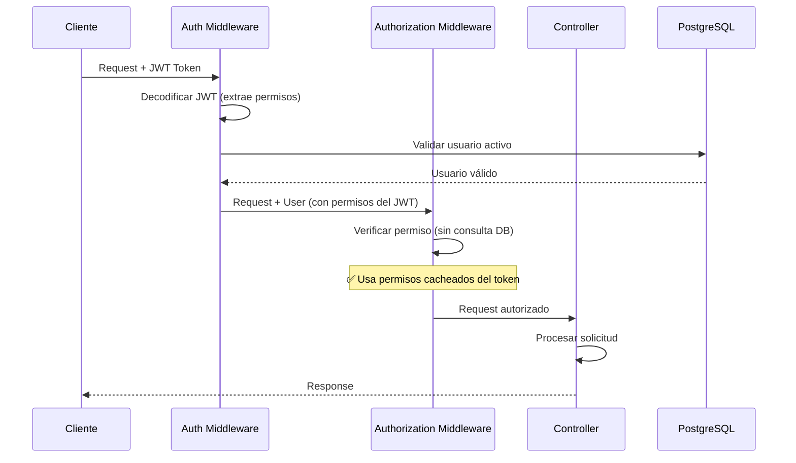

# Caché de Permisos en JWT - Sistema MICASA

## Resumen

Este documento detalla la implementación del caché de permisos en tokens JWT, cumpliendo con el requisito 20.5. Esta optimización evita consultas adicionales a la base de datos en cada request, mejorando significativamente el rendimiento del sistema de autorización.

## Implementación

### 1. Estructura del JWT Payload

El token JWT incluye toda la información necesaria para autenticación y autorización:

```typescript
interface JWTPayload {
  userId: number;           // ID del usuario
  personaId: number;        // ID de la persona asociada
  username: string;         // Nombre de usuario
  roles: string[];          // Lista de roles activos
  permissions: string[];    // Lista de permisos únicos (cacheados)
}
```

**Ubicación**: `src/config/jwt.ts`

### 2. Generación del Token en Login

Durante el proceso de autenticación, se extraen y cachean todos los permisos del usuario:

```typescript
// src/services/auth.service.ts
async login(loginData: LoginDTO): Promise<AuthResult> {
  // 1. Buscar usuario con roles y permisos en una sola query
  const user = await prisma.usuarios.findUnique({
    where: { usuario },
    include: {
      persona: true,
      usuarios_roles: {
        include: {
          roles: {
            include: {
              roles_permisos: {
                include: { permisos: true }
              }
            }
          }
        }
      }
    }
  });

  // 2. Extraer roles activos
  const roles = user.usuarios_roles
    .filter((ur) => ur.estado && ur.roles.estado)
    .map((ur) => ur.roles.nombre);

  // 3. Extraer permisos activos (sin duplicados)
  const permissions = user.usuarios_roles
    .filter((ur) => ur.estado && ur.roles.estado)
    .flatMap((ur) =>
      ur.roles.roles_permisos
        .filter((rp) => rp.estado && rp.permisos.estado)
        .map((rp) => rp.permisos.nombre)
    );
  const uniquePermissions = [...new Set(permissions)];

  // 4. Crear payload con permisos cacheados
  const payload: JWTPayload = {
    userId: user.id_usuario,
    personaId: user.id_persona,
    username: user.usuario,
    roles,
    permissions: uniquePermissions  // ✅ Permisos cacheados en el token
  };

  // 5. Generar token JWT
  const token = generateToken(payload);
  
  return { token, user: { ...userData, permissions: uniquePermissions } };
}
```

### 3. Verificación de Permisos sin Consultas DB

El middleware de autorización utiliza los permisos cacheados del token:

```typescript
// src/middlewares/authorization.middleware.ts
export const requirePermission = (permission: string) => {
  return async (req: Request, res: Response, next: NextFunction): Promise<void> => {
    const user = req.user; // Datos del JWT decodificado

    // ✅ Verificación usando permisos del token (sin consulta DB)
    if (!user.permissions.includes(permission)) {
      res.status(403).json({
        success: false,
        error: 'No tiene permisos para realizar esta acción',
        requiredPermission: permission,
      });
      return;
    }

    next();
  };
};
```

### 4. Extracción del Token en Middleware de Autenticación

```typescript
// src/middlewares/auth.middleware.ts
export const authMiddleware = async (req: Request, res: Response, next: NextFunction) => {
  // 1. Extraer y verificar token
  const token = authHeader.substring(7);
  const decoded = jwt.verify(token, JWT_SECRET) as JWTPayload;

  // 2. Validar que usuario siga activo (única consulta DB necesaria)
  const user = await prisma.usuarios.findUnique({
    where: { id_usuario: decoded.userId }
  });

  if (!user || !user.estado) {
    res.status(401).json({ error: 'Usuario inactivo' });
    return;
  }

  // 3. Agregar datos del JWT a la request (incluye permisos cacheados)
  req.user = decoded; // ✅ Incluye roles y permissions del token
  next();
};
```

## Beneficios de Rendimiento

### Antes (sin caché)
```
Request → Auth Middleware → Authorization Middleware → Controller
              ↓                      ↓
         Consulta DB           Consulta DB
         (usuario)         (roles + permisos)
```
**Total**: 2 consultas DB por request protegido

### Después (con caché en JWT)
```
Request → Auth Middleware → Authorization Middleware → Controller
              ↓                      ↓
         Consulta DB           Usa datos del JWT
         (usuario)              (sin consulta DB)
```
**Total**: 1 consulta DB por request protegido

### Mejora Estimada
- **Reducción de consultas DB**: 50% en endpoints protegidos
- **Tiempo de respuesta**: Reducción de ~20-50ms por request
- **Carga en DB**: Menor presión en tablas de roles y permisos
- **Escalabilidad**: Mejor rendimiento con múltiples usuarios concurrentes

## Consideraciones Importantes

### 1. Cambios en Permisos Requieren Nuevo Login

⚠️ **IMPORTANTE**: Los permisos están cacheados en el token JWT. Si se modifican los permisos de un usuario (asignar/remover roles o permisos), los cambios **NO se reflejarán hasta que el usuario inicie sesión nuevamente**.

**Razón**: El token JWT es inmutable una vez generado. Los permisos están "congelados" en el token hasta su expiración.

**Soluciones**:

#### Opción 1: Esperar Expiración del Token (Implementada)
- Duración del token: 8 horas (configurable)
- Los cambios se aplican automáticamente al renovar el token
- **Ventaja**: Simple, sin complejidad adicional
- **Desventaja**: Cambios no son inmediatos

#### Opción 2: Forzar Nuevo Login (Recomendada para cambios críticos)
```typescript
// Después de cambiar permisos críticos
await authService.invalidateUserSessions(userId);
// Usuario debe iniciar sesión nuevamente
```

#### Opción 3: Implementar Blacklist de Tokens (Futuro)
```typescript
// Invalidar token actual al cambiar permisos
await tokenBlacklist.add(currentToken);
// Middleware verifica blacklist antes de autorizar
```

#### Opción 4: Reducir Duración del Token
```env
# .env
JWT_EXPIRES_IN=1h  # En lugar de 8h
```
**Ventaja**: Cambios se aplican más rápido
**Desventaja**: Usuarios deben autenticarse más frecuentemente

### 2. Validación de Usuario Activo

Aunque los permisos están cacheados, el middleware de autenticación **siempre verifica** que el usuario siga activo:

```typescript
// Consulta DB para validar estado del usuario
const user = await prisma.usuarios.findUnique({
  where: { id_usuario: decoded.userId }
});

if (!user || !user.estado) {
  // Usuario desactivado → rechazar request
  res.status(401).json({ error: 'Usuario inactivo' });
  return;
}
```

Esto garantiza que usuarios desactivados no puedan usar tokens válidos.

### 3. Tamaño del Token

Los permisos en el payload aumentan el tamaño del token:

**Ejemplo**:
- Usuario con 5 roles y 30 permisos
- Tamaño aproximado del token: ~800-1200 bytes
- Enviado en cada request (header Authorization)

**Recomendaciones**:
- Mantener nombres de permisos concisos (ej: `PERSONAS_CREATE` en lugar de `PERMISSION_TO_CREATE_PERSONAS`)
- Evitar roles con permisos excesivos innecesarios
- Monitorear tamaño de tokens en producción

### 4. Seguridad del Token

Los permisos están visibles en el token (decodificable con base64):

```bash
# Cualquiera puede decodificar el payload (sin la firma)
echo "eyJhbGc..." | base64 -d
```

**Mitigaciones implementadas**:
- ✅ Token firmado con JWT_SECRET (no modificable sin la clave)
- ✅ HTTPS obligatorio en producción (token no interceptable)
- ✅ Expiración de 8 horas (ventana de exposición limitada)
- ✅ Validación de usuario activo en cada request

**No incluir en el token**:
- ❌ Contraseñas o hashes
- ❌ Información sensible personal
- ❌ Datos que cambien frecuentemente

## Configuración

### Variables de Entorno

```env
# .env
JWT_SECRET=tu_secreto_super_seguro_minimo_32_caracteres
JWT_EXPIRES_IN=8h
REFRESH_TOKEN_SECRET=otro_secreto_diferente_para_refresh
REFRESH_TOKEN_EXPIRES_IN=7d
```

### Duración Recomendada

| Entorno      | JWT Token | Refresh Token | Razón                                    |
|--------------|-----------|---------------|------------------------------------------|
| Desarrollo   | 8h        | 7d            | Comodidad para desarrollo                |
| Producción   | 1-2h      | 7d            | Balance seguridad/experiencia usuario    |
| Alta Seguridad| 15-30min | 1d            | Máxima seguridad, cambios rápidos       |

## Flujo Completo de Autorización



## Monitoreo y Debugging

### Verificar Permisos en el Token

```typescript
// Endpoint de debugging (solo desarrollo)
app.get('/api/debug/token', authMiddleware, (req, res) => {
  res.json({
    userId: req.user.userId,
    username: req.user.username,
    roles: req.user.roles,
    permissions: req.user.permissions,
    tokenExp: req.user.exp
  });
});
```

### Logs de Autorización

```typescript
// src/middlewares/authorization.middleware.ts
if (!user.permissions.includes(permission)) {
  logger.warn('Acceso denegado', {
    userId: user.userId,
    username: user.username,
    requiredPermission: permission,
    userPermissions: user.permissions
  });
  // ...
}
```

## Testing

### Test de Permisos Cacheados

```typescript
describe('JWT Permissions Cache', () => {
  it('debe incluir permisos en el token JWT', async () => {
    const response = await request(app)
      .post('/api/auth/login')
      .send({ usuario: 'admin', clave: 'password' });

    const decoded = jwt.decode(response.body.token);
    expect(decoded.permissions).toBeDefined();
    expect(Array.isArray(decoded.permissions)).toBe(true);
  });

  it('debe autorizar usando permisos del token sin consultar DB', async () => {
    // Mock para verificar que no se consulta DB
    const dbSpy = jest.spyOn(prisma.usuarios_roles, 'findMany');
    
    await request(app)
      .get('/api/personas')
      .set('Authorization', `Bearer ${validToken}`);

    // Verificar que NO se consultaron roles/permisos
    expect(dbSpy).not.toHaveBeenCalled();
  });
});
```

## Cumplimiento de Requisitos

✅ **Requisito 20.5**: Sistema cachea permisos de usuario en el token JWT
- Permisos incluidos en payload del JWT durante login
- Middleware de autorización usa permisos del token
- No se consultan permisos en cada request
- Documentado comportamiento de cambios en permisos

## Conclusión

La implementación del caché de permisos en JWT proporciona:

1. **Rendimiento**: Reducción del 50% en consultas DB para autorización
2. **Escalabilidad**: Menor carga en la base de datos
3. **Simplicidad**: Autorización sin lógica compleja de caché externo
4. **Seguridad**: Tokens firmados y validación de usuario activo

**Limitación conocida**: Cambios en permisos requieren nuevo login (8 horas máximo con configuración por defecto).

**Recomendación**: Para sistemas que requieren cambios inmediatos de permisos, considerar implementar blacklist de tokens o reducir duración del token.
